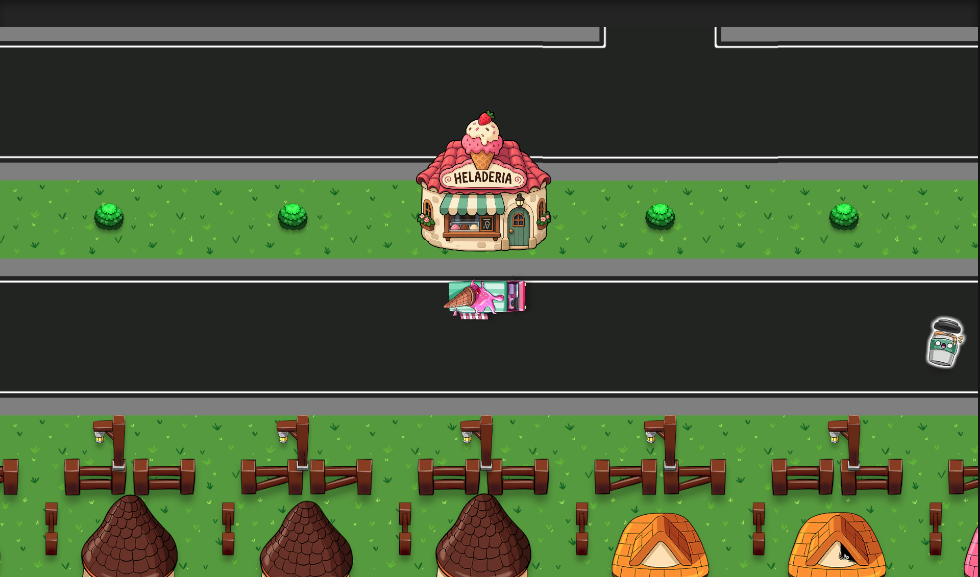
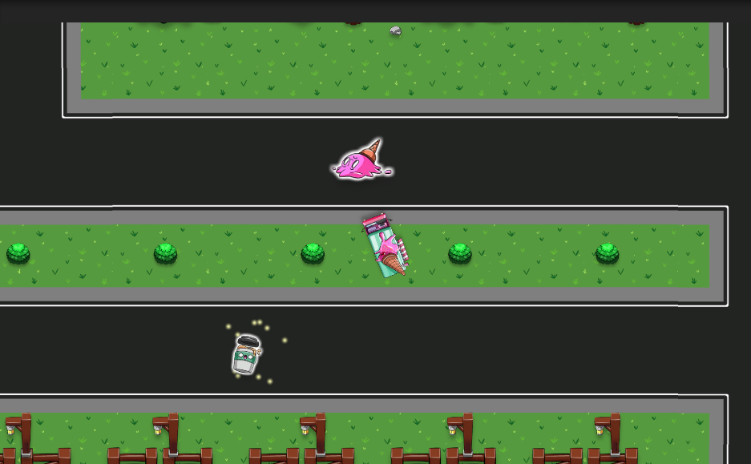
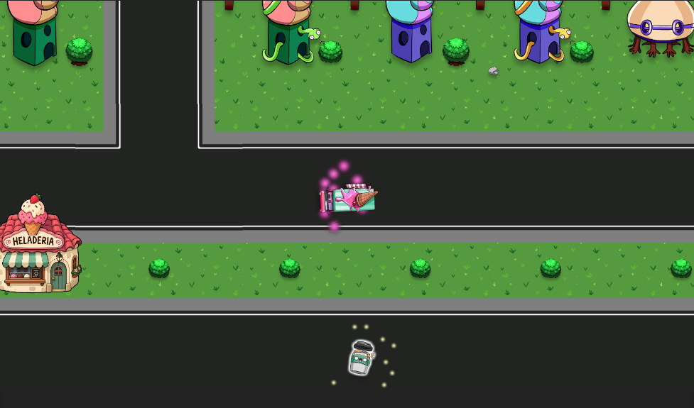

# Delivery Dash

A 2D driving and delivery game prototype built with Unity and C#. Drive an ice cream truck around a colorful neighborhood, collect packages, and take them to customers. Pick up a Boost along the way for a short burst of speed.

## What I built

- **Vehicle controls:** forward and reverse movement with keyboard steering using Unity's Input System.
- **Pickup and delivery loop:** the truck can carry one package at a time. Collecting a package removes it from the scene; reaching a customer completes the delivery and lets the truck collect another package.
- **Delivery feedback:** particles play while the truck is carrying a package and stop when it reaches a customer.
- **Temporary speed boosts:** driving over a Boost consumes the pickup and adds 5 to the truck's movement speed for 2 seconds. Collecting another Boost refreshes the timer without stacking the speed increase.
- **Boost indicator:** the `BOOST ACTIVATED` text appears while the speed boost is active and disappears when it ends.
- **A decorated neighborhood:** roads, grass, trees, fences, colorful houses, and an ice cream shop give the driving area its setting.

## Controls

| Key | Action |
| --- | --- |
| W | Drive forward |
| S | Reverse |
| A | Turn left |
| D | Turn right |

Drive over pickups and customer areas to interact with them—no extra button is needed.

## Screenshots

### Exploring and collecting pickups

### Carrying a delivery

## Run the project

1. Install **Unity 6000.6.0f1** through Unity Hub, matching the version in `ProjectSettings/ProjectVersion.txt`.
2. Add this repository's root folder as a project in Unity Hub and open it.
3. Let Unity import the assets and resolve the packages.
4. Open `Assets/Scenes/SampleScene.unity`.
5. Press **Play**, click inside the Game view, and use **WASD** to drive.

## Project structure

| Path | Contents |
| --- | --- |
| `Assets/Scenes/SampleScene.unity` | Main game scene |
| `Assets/Scripts/Driver.cs` | Driving, Boost duration, and Boost text visibility |
| `Assets/Scripts/Package.cs` | Package collection, customer deliveries, and Boost pickups |
| `Assets/Scripts/MinimapTracker.cs` | Utility for mapping a target's position and rotation to a UI marker |
| `Assets/Prefabs/` | Reusable game objects |
| `Assets/Sprites/` | Game artwork |
| `publics/` | Screenshots used in this README |

The project uses Unity's Universal Render Pipeline, Input System, and TextMesh Pro. It is a playable prototype focused on driving, deliveries, and temporary power-ups.
